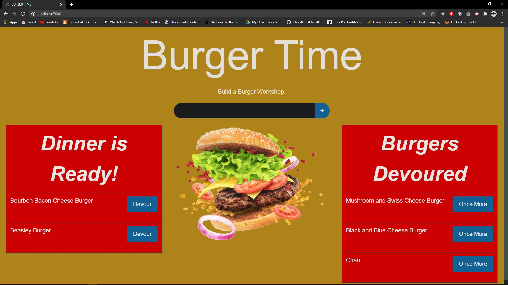
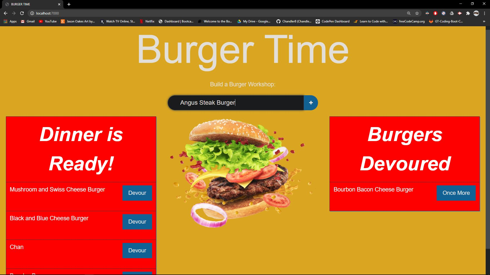

# Burger Node Handlebars


The following application will allow for users to create and store information related to their favorite hamburgers. By utilizing technologies such as; MySQL, Handlebars, Node.js, HTML, CSS, and others, users are able to enter information regarding their favorite hamburgers or a hamburger they have eaten. Then users are able to access this subsequent information whenever they would like to, since this data is being stored in a database. Users can enter any number of unique burger names into the input form and then denote whether they have eaten the burger, have not yet eaten the burger, or would like to eat the subsequent burger once again. To view this application in action, please follow this link to see it deployed via Heroku: LINKTBD

## Description

- Burger Eater! is a restaurant app that lets users input the names of burgers they'd like to eat.

- Whenever a user submits a burger's name, your app will display the burger on the left side of the page -- waiting to be devoured.

- Each burger in the waiting area also has a Devour it! button. When the user clicks it, the burger will move to the right side of the page.

- App will store every burger in a database, whether devoured or not.

## User Story

```
As a burger lover
I want to be able to absolutely munch on, and keep track of my burgers eaten
So that I can potentially eat the same burger again
```

## Table of Contents

* [Directory](#Directory)
* [License](#license)
* [Questions](#questions)
* [Contributors](#contributors)
* [Media](#media)

## Directory

All the files and directories from the application are listed below:

```
.
├── config
│   ├── connection.js
│   └── orm.js
│ 
├── controllers
│   └── burgers_controller.js
│
├── db
│   ├── schema.sql
│   └── seeds.sql
│
├── models
│   └── burger.js
│ 
├── node_modules
│ 
├
│
├── public
│   └── assets
│       ├── css
│       │   └── style.css
│       └── img
│       │   └── burger-other.png
|       └── js
│           └── app.js
│
├
│── views
|   ├── index.handlebars
|    └── layouts
|        └── main.handlebars
|    └── partials\burgers
|        └── burger-block.handlebars
|
├── server.js

```

# License

Application working under an MIT license

# Questions

Reach out to me via email regarding any questions or concerns with this project:
- chandler.lowrance1@gmail.com


# Contributors

| Chandler
------------ 

[<br /><sub><b>Chandler Lowrance</b></sub>](https://github.com/Chandler8)<br />[💻](https://github.com/Chandler8?tab=repositories "Repositories")

# Media


